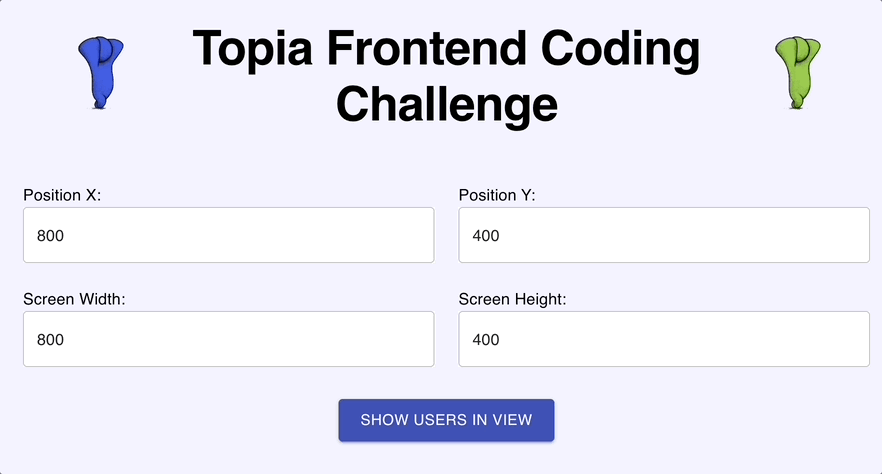

<p align="center">
    
</p>

# Topia Frontend Coding Challenge

## Overview

Welcome to the Topia Frontend Coding Challenge repository! This project is a showcase of front-end technologies combining a graphical canvas, user interface, and streaming system to deliver a unique experience. The main objective is to enhance the algorithm responsible for maintaining peer avatars on the canvas based on the user's viewport, wrapped in a custom-designed user interface.

### Technologies
- **React**: A JavaScript library for building user interfaces.
- **Material-UI**: A popular React UI framework.
- **NPM**: A package manager for JavaScript and the world's largest software registry.

## Features

- **Dynamic Avatar Management**: Rewrite and implement the central algorithm that determines which peer avatars are present on the canvas depending on the user's viewport.
- **Interactive User List**: Implement a modal launched via a 'User List' button to display users within the visible screen, centered around the coordinates (x, y).
- **Editable Modal**: Allow 'x, y' values to be editable in the modal, updating the results live.
- **User Sorting and Display**: Sort and display users in a table format based on their distance to the center (x, y) and indicate if they are broadcasters.

## Getting Started

### Prerequisites
Ensure you have the following installed:
- Node.js
- npm

### Installation
1. Clone the repository:
```sh 
git clone https://github.com/newnezz/Topia-challenge.git
```
2. Navigate to the project directory and install dependencies:
```sh
cd Topia-challenge && npm install
```

### Running the Project
To run the application on your local machine:
Visit `http://localhost:3000/` to view the application.

## Usage

- **Launch Application**: Run the application and navigate to the main interface.
- **Access User List**: Click the 'User List' button to open the modal displaying the user list.
- **Edit Coordinates**: Change the 'x' and 'y' coordinates in the modal or main menu, updating the list of visible users dynamically.
- **View and Sort Users**: Observe the users listed in the table, sorted by proximity with broadcaster status noted by icon.

## Acknowledgments
- Special thanks to the Topia team for providing the opportunity and challenge.
